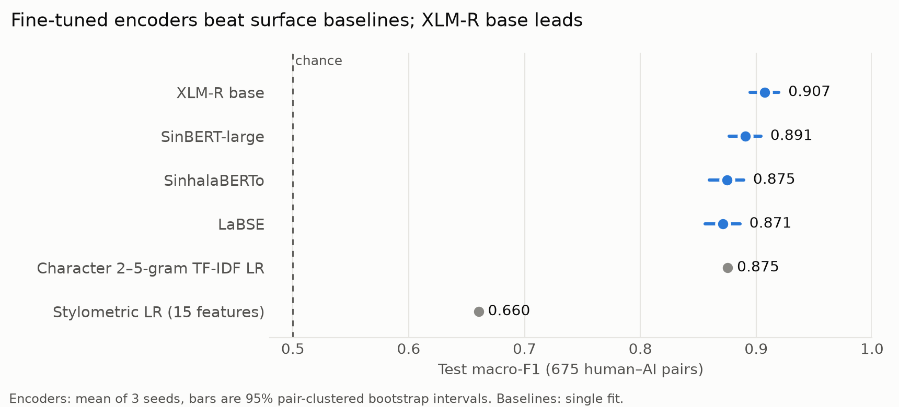
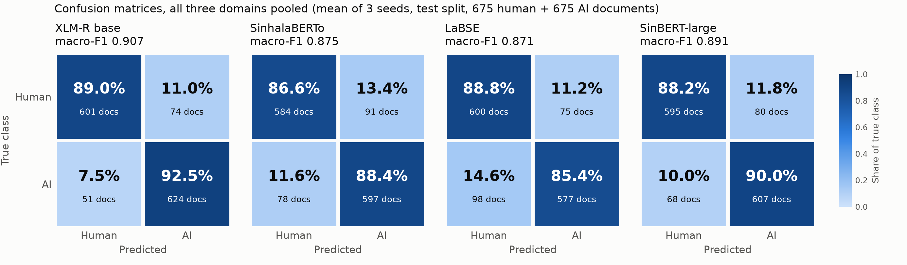
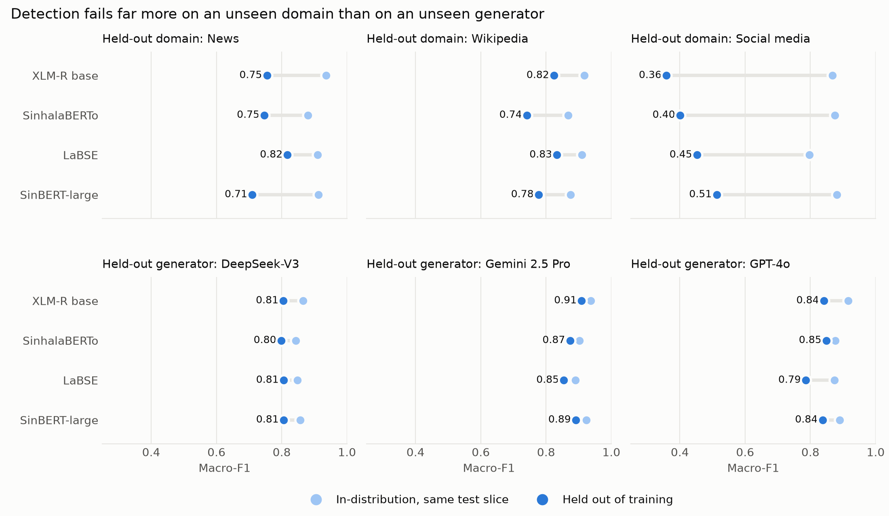

# SAID Hat — Generation and Classsification

Sinhala AI-vs-human text detection.

- [`generation/`](generation/README.md) — pipeline that generates AI text samples (and builds the
  paired human datasets) across news, Wikipedia and social media domains.
- [`classification/`](classification/README.md) — binary human-vs-AI detection on Sinhala-HAT:
  experiment code and results. The dataset is on the Hugging Face Hub as
  [`said-sinhala-ai-dataset/said-hat`](https://huggingface.co/datasets/said-sinhala-ai-dataset/said-hat).

## Dataset

[**Sinhala-HAT**](https://huggingface.co/datasets/said-sinhala-ai-dataset/said-hat) (Human and
AI-generated Text) is the document-level subset of **SAID**, the Sinhala AI-text Identification
Dataset. It has 8,994 texts: 4,497 human texts, each paired with an AI text derived from it, across
news, social media and Wikipedia. The AI texts come from Gemini 2.5 Pro, DeepSeek-V3 and GPT-4o.
Each AI text is either written from the human text's title (Mode A, news and Wikipedia only) or a
paraphrase of it (Mode B, all three domains). It is released under CC BY-SA 4.0.

```python
from datasets import load_dataset

ds = load_dataset("said-sinhala-ai-dataset/said-hat")                  # all three domains, pooled
ds = load_dataset("said-sinhala-ai-dataset/said-hat", "news")
ds = load_dataset("said-sinhala-ai-dataset/said-hat", "social_media")
ds = load_dataset("said-sinhala-ai-dataset/said-hat", "wikipedia")
```

| Config | Train | Validation | Test | Total |
|---|---|---|---|---|
| `news` | 2,048 | 460 | 486 | 2,994 |
| `social_media` | 2,090 | 454 | 456 | 3,000 |
| `wikipedia` | 2,156 | 436 | 408 | 3,000 |
| `default` (pooled) | 6,294 | 1,350 | 1,350 | 8,994 |

Every split is 50% human and 50% AI, and a human text and its AI partner always fall in the same
split. The columns are `text_id`, `text`, `label` (0 human, 1 AI), `domain`, `generator`,
`generation_mode`, `source_id`, `group`, `prompt_id`, `input_tokens`, `output_tokens`, `word_count`
and `split`; see the [dataset card](https://huggingface.co/datasets/said-sinhala-ai-dataset/said-hat)
for details.

**Social media has no punctuation.** The human posts in the source corpus already had almost none
(7 of 1,500 posts), while the generators wrote punctuated text (97.1% of 1,500 posts), so
punctuation alone would separate the classes. Every punctuation and symbol character is therefore
removed from the social-media text of both classes. News and Wikipedia are unchanged.

**Sources:** news from [NSINA](https://huggingface.co/datasets/sinhala-nlp/NSINA), social media from
[Facebook Decade Corpora](https://huggingface.co/datasets/sinhala-nlp/FacebookDecadeCorpora), and
Wikipedia from [Wikipedia Monthly](https://huggingface.co/datasets/omarkamali/wikipedia-monthly)
(articles created and last edited before 2022-11-30, the public launch of ChatGPT).

## Results

### Detection

Fine-tuned encoders reach 0.87–0.91 macro-F1 on the test split. XLM-R base is best (0.907),
SinBERT-large is close behind (0.891), and a character TF-IDF baseline matches the two weakest
encoders (0.875). A logistic regression on 15 stylometric features reaches only 0.660.



All four models make both kinds of error at similar rates, between 7% and 15% per class:



### Generalisation

Holding a whole domain out of training costs 0.08–0.51 macro-F1. Social media is the hardest domain
to reach: models trained on news and Wikipedia score 0.36–0.51 on it, at or below chance. Holding
out one generator costs far less (0.03–0.09), so domain shift is the larger problem.



Cutting the training set from 6,294 to 4,500 rows costs at most 0.024 macro-F1, so these drops are
not a data-size effect. All numbers are in [`classification/results/`](classification/results/).
